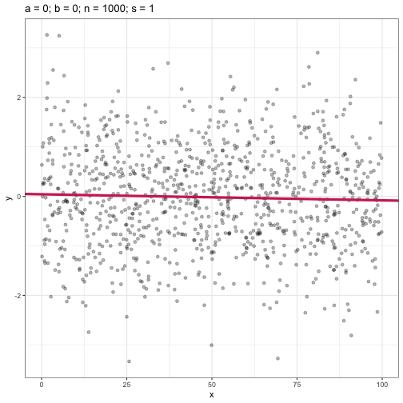
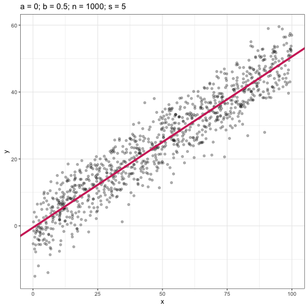
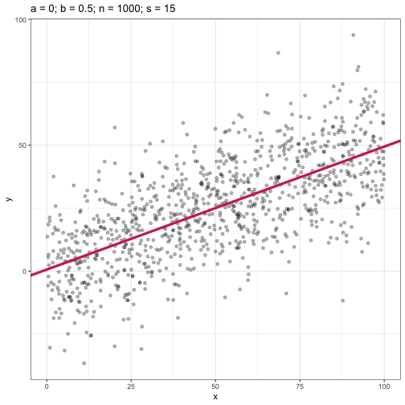

# Preamble


All questions are evaluated in order. All necessary state configuration, including the PRNG seed, is given below:


```r
set.seed(0xABBA)
```

# Question 1

# Question 2

# Question 3

# Question 4

# Question 5

See `analysis.R` for the definition of the function `sim_and_plot()`.




\@ref(fig:q5f1) checks to make sure that the code renders a flat line in the trivial case.




# Question 6

# Extra Credit
